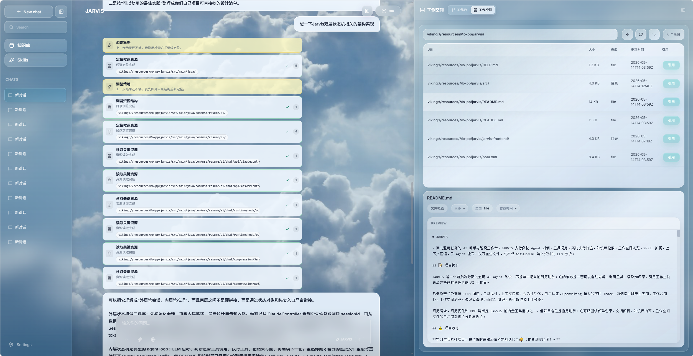
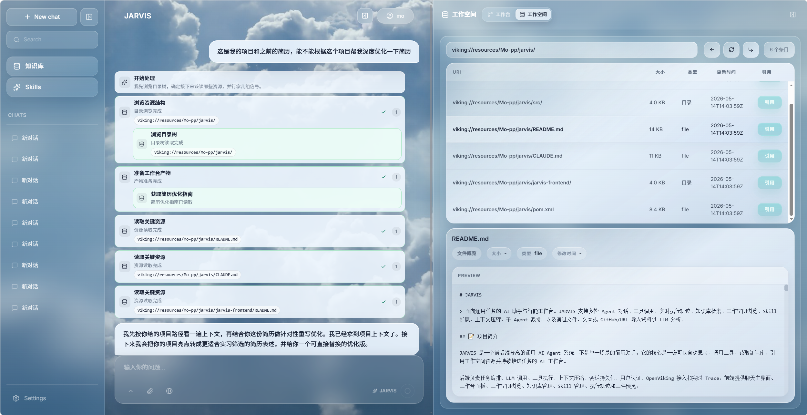
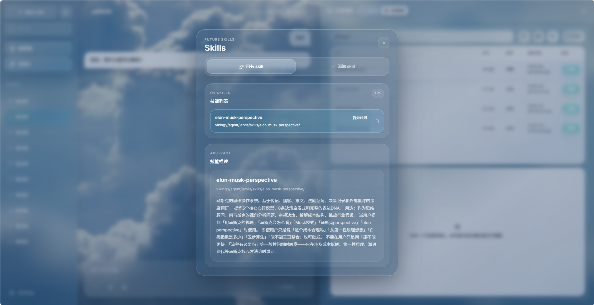

# Jarvis 智能工作台

## 示例截图

以下截图展示了 JARVIS 的对话工作台、执行轨迹和结果预览效果。








> 面向通用任务的 AI 助手与智能工作台。JARVIS 支持多轮 Agent 对话、工具调用、实时执行轨迹、知识库检索、工作空间浏览、Skill 扩展、上下文压缩、子 Agent 派发，以及通过文件、文本或 GitHub/URL 导入资料供 LLM 分析。

## 📝 项目简介

JARVIS 是一个前后端分离的通用 AI Agent 系统，不是单一场景的简历助手。它的核心是一套可以自动思考、调用工具、读取知识库、引用工作空间资源并持续推进任务的 AI 工作台。

后端负责任务编排、LLM 调用、工具执行、上下文压缩、会话持久化、用户认证、OpenViking 接入和实时 Trace；前端提供聊天主界面、工作台面板、工作空间浏览、知识库管理、Skill 管理、执行轨迹和工件预览。

简历编辑、简历优化和 PDF 导出是 JARVIS 的内置工具能力之一，但项目定位是通用助手：它可以围绕代码仓库、文档资料、知识库内容、工作空间文件和用户问题进行分析与执行。

## ⚠️ 项目状态

**学习与实验性项目，按作者时间和心情不定期迭代中😂（作者没啥时间）。**

当前项目主要用于验证 Agent 状态机、工具系统、OpenViking 知识/记忆层、Skill/MCP 扩展、上下文压缩、子 Agent 和前后端实时交互等工程方案。接口、配置项和数据结构仍可能调整。

## ✨ 功能概览

### 🤖 自主 Agent 执行引擎

- 基于 LangGraph4j 构建双层状态机：外层管理会话生命周期，内层执行“LLM 思考 → 工具调用 → 观察结果 → 继续推进”的 Agent 循环。
- 同时提供普通对话和 SSE 流式对话；React 前端通过流事件实时接收文本增量、工具调用、任务更新、用户追问、子 Agent 派发和最终完成状态。
- 支持 TaskPlan 任务规划，LLM 可以创建、更新和回传任务列表，前端可展示当前任务进度。
- 支持 AskUserQuestion 阻塞-恢复：Agent 需要补充信息时挂起会话，用户回答后从 Redis 恢复状态并继续执行。
- 支持子 Agent 派发，父 Agent 可把探索、规划等子任务交给隔离的子状态机执行；子 Agent 复用父级静态前缀以提高 prefix cache 命中机会，并限制递归派发和用户追问。
- 支持上下文分级压缩：L1 Tool Result Budget 持久化大工具结果并保留预览，L3 Microcompact 清理过时工具输出，L5 Autocompact 兜底摘要；L4 Context Collapse 当前仍是预留 Stub。
- 为缓存命中率做了系统 Prompt 静态/动态分区、延迟工具加载、子 Agent 前缀复用和 CacheTracker 观测，减少不必要的 schema 与上下文抖动。

### 🧠 AI 工作台与统一工作空间

- React 前端不是单纯聊天框，而是带会话列表、执行轨迹、任务面板、资源引用、知识库、Skills、设置和结构化产物预览的 AI 工作台。
- 后端提供统一产物协议 `ChatArtifact(type, payload, source)`，前端按类型分发到工作台组件，目前覆盖 `mindmap`、`resume`、`optimize_result`、`markdown`，并兼容问卷式用户追问。
- 支持从工作台添加资料：上传文件、创建 Markdown 文本资源、导入 HTTP(S)/Git/SSH URL；资源统一进入 OpenViking 的 `viking://resources/` 命名空间。
- 支持浏览资源库目录、查看资源详情、摘要、概览和预览内容，也支持删除资源包。
- 支持只读浏览 OpenViking 工作空间，从 `viking://` 根目录查看不同命名空间下的目录和文件预览。
- 对话输入可引用 `viking://...` 资源 URI，前端会把引用路径作为明确上下文提示发送给 Agent。
- 内置简历工作台能力，包括结构化简历预览、优化结果展示和前端 HTML 到 PDF 导出；这些只是通用工作台产物的一类。

### 🔭 实时可观测性与 Trace

- SSE 事件覆盖 `session_started`、`message_delta`、`run_step`、`tool_use_*`、`artifact_ready`、`delegation_*`、`task_update`、`ask_user_question`、`pending`、`done` 和 `error` 等执行过程。
- TraceService 为主 Agent 和子 Agent 记录 LLM 轮次、工具批次、工具调用、产物生成、用户追问和派发结果，前端可按层级展示运行步骤。
- TimelineAction 持久化到 MySQL，支持会话历史中的执行轨迹回放；Trace Stream 通过 Redis Pub/Sub 分发，并提供 debug 接口查看状态、最近事件、死信和回放。
- CacheTracker 从 LangChain4j `tokenUsage` 中兼容提取 cached tokens，记录缓存命中率、热度等级和连续未命中次数，用于定位 Prompt 稳定性问题。

### 🧩 工具系统、Skill 与 MCP 扩展

- 工具分为核心工具和延迟工具：核心工具随 Agent 常驻，延迟工具通过 `toolSearch` 按需发现，降低每轮 LLM 调用的工具 schema 成本。
- 已内置时间查询、任务规划、用户追问、Artifact 发布、思维导图、子 Agent 派发、OpenViking 搜索/Skill 读取、用户记忆读写、简历指导与优化等工具。
- 支持 Hook 机制，对工具调用做前置/后置拦截、审计、限流和规则控制，子 Agent 相关限制也通过工具执行链路落实。
- Skill 存储在 OpenViking 的 Agent 技能目录下；React 前端可查看用户私有 Skill 列表、摘要、上传和删除。
- Skill 上传支持 `.zip` 和 `.skill` 文件，Agent 可通过 OpenViking Skill 工具检索并读取已上传 Skill 的 `SKILL.md` 及辅助内容。
- MCP 集成可接入外部工具与资源，当前支持 SSE HTTP、Streamable HTTP 和 STDIO 三种传输；MCP 工具可配置为核心或延迟暴露，并支持工具名前缀、allow/deny 过滤、超时、工具列表缓存和资源读取。

### 📚 OpenViking 知识与长期记忆

- OpenViking 作为外部知识、工作空间、Skill 和长期记忆的统一后端；注册时会为用户开通对应的 OpenViking 管理身份。
- 提供 OpenViking 搜索和 Skill 读取工具，Agent 可以检索知识库内容，也可以读取指定资源 URI 的内容。
- 长期记忆工具支持写入普通记忆、写入用户偏好、读取记忆概览和读取 L2 记忆明细；记忆文件以 Markdown 形式落在用户记忆命名空间。
- 记忆召回支持基于用户输入的触发策略：当问题明显需要“之前说过”“我的偏好”“长期记忆”等上下文时，自动从用户记忆范围召回候选内容，并按预算注入 Prompt。
- 当前记忆召回实现偏工程策略与 OpenViking 检索能力组合，README 不把它描述成独立向量数据库或未实现的语义引擎。

### 🔐 用户与安全

- 会话和消息持久化到 MySQL
- Redis 承载 JWT 黑名单、邮箱验证码、请求限流、文件解析临时内容和 Trace Stream 等短期状态
- JWT Token 认证
- Spring Security 权限控制
- 邮箱验证码注册与密码重置
- 基础接口限流防刷
- CORS 跨域配置
- 本地私有配置与密钥文件默认忽略，不进入公开仓库

## 🏗️ 架构概览

JARVIS 后端采用双层状态机。

外层状态机负责会话生命周期：

```text
START -> session_init -> run_inner_loop -> usage_stat -> END
```

内层状态机负责单次查询的 Agent 循环：

```text
call_llm -> route -> execute_tool / error_recovery / END
```

LLM 每轮响应后，系统会根据响应类型决定下一步：如果包含工具调用，则执行工具并把结果写回消息历史；如果是普通文本，则认为当前任务已经完成并结束本轮循环；如果发生异常，则进入错误恢复节点。子 Agent 会额外受最大轮次限制约束。

## 📊 数据库设计

当前 MySQL 表结构由 Flyway 迁移脚本维护，迁移文件位于 `src/main/resources/db/migration/`。

### 主要数据表

- `db_account` - 用户账户，保存用户名、BCrypt 密码、邮箱、头像、注册时间和 OpenViking 管理密钥
- `ai_session` - AI 会话元信息，保存会话 ID、所属用户、标题、状态、置顶信息、Token 统计和活跃时间
- `ai_message` - 会话消息历史，保存用户消息、AI 消息、工具调用 JSON、工具执行结果、消息 Token 数和压缩标记
- `ai_timeline_action` - 前端可回放的执行轨迹，保存工具调用、任务状态、子 Agent 过程等 UI 时间线事件

### 关系概览

```text
db_account.username
  └── ai_session.owner_username
        ├── ai_message.session_id
        └── ai_timeline_action.session_id
```

知识库、Skill、长期记忆和工作空间资源由 OpenViking 侧服务管理，JARVIS 通过接口和工具接入。

## 🛠️ 技术栈

### 后端

- **语言**: Java 21
- **框架**: Spring Boot 4.0.5
- **Agent 状态机**: LangGraph4j 1.8.11
- **LLM 抽象**: LangChain4j 1.13.0
- **数据库**: MySQL 8.0+、MyBatis-Plus
- **缓存**: Redis
- **数据库迁移**: Flyway
- **安全**: Spring Security + JWT
- **邮件**: Spring Mail
- **文件解析**: Apache PDFBox、Apache POI、Jsoup
- **PDF/页面渲染**: Playwright（用于简历 PDF 导出）

### 前端

- **框架**: React 19 + Vite
- **语言**: TypeScript
- **HTTP 客户端**: Axios
- **样式**: Tailwind CSS
- **图标**: lucide-react
- **思维导图**: markmap-lib、markmap-view
- **可视化**: D3

### LLM 与集成

- OpenAI 兼容 Chat Completions
- 智谱 GLM
- 通义千问 DashScope
- 百度千帆 Coding Plan
- MCP 工具接入
- OpenViking 资源、Skill 与记忆系统

## 📦 项目结构

```text
JARVIS/
├── src/                              # 后端源码
│   ├── main/
│   │   ├── java/com/msz/resume/ai/
│   │   │   ├── agent/                # 子 Agent 类型与注册
│   │   │   ├── auth/                 # 用户认证、JWT、限流、邮件验证码
│   │   │   ├── bootstrap/            # 调试入口
│   │   │   ├── chat/                 # Agent 会话、状态机、LLM、压缩、Trace
│   │   │   ├── file/                 # 文件上传、存储和解析
│   │   │   ├── hook/                 # 工具 Hook 配置与执行
│   │   │   ├── integrations/         # MCP、OpenViking 集成
│   │   │   ├── memory/               # 用户记忆工具
│   │   │   ├── resume/               # 简历编辑、优化与导出工具
│   │   │   ├── shared/               # 通用模型和工具类
│   │   │   └── tool/                 # 工具注册中心与基础工具
│   │   └── resources/
│   │       ├── db/migration/         # Flyway 数据库迁移
│   │       ├── hooks/                # 工具 Hook 配置
│   │       ├── prompts/              # YAML 系统提示词
│   │       └── application.yml       # 后端配置
│   └── test/                         # 后端测试
├── jarvis-frontend/                  # React 前端
│   ├── src/
│   │   ├── components/               # 页面与业务组件
│   │   ├── hooks/                    # 流式对话等 React Hook
│   │   ├── services/                 # API 客户端
│   │   └── types/                    # 类型定义
├── .mvn/                             # 项目级 Maven 配置
└── pom.xml                           # Maven 配置
```

> 公开发布版本默认不包含 `docs/`、本地 `.env`、`application-dev.yml`、`application-local.yml`、构建产物和个人开发环境目录。

## 🚀 快速开始

### 环境要求

- JDK 21
- Maven 3.9+
- Node.js 20+
- MySQL 8.0+
- Redis
- 至少一个可用的 LLM API Key
- OpenViking 服务与 API Key（注册、知识库、工作空间、Skill 和记忆能力依赖它）

项目内置 `.mvn/settings.xml`，默认将 Maven Central 请求切到阿里云 Maven 公共镜像，以提升国内环境下的依赖下载速度。

### 1. 准备数据库

```sql
CREATE DATABASE ai_resume CHARACTER SET utf8mb4 COLLATE utf8mb4_unicode_ci;
```

应用启动后 Flyway 会自动执行 `src/main/resources/db/migration/` 下的迁移脚本。

### 2. 配置后端环境变量

最小启动配置示例：

```bash
export SPRING_DATASOURCE_URL="jdbc:mysql://localhost:3306/ai_resume?useUnicode=true&characterEncoding=utf-8&serverTimezone=Asia/Shanghai"
export SPRING_DATASOURCE_USERNAME="root"
export SPRING_DATASOURCE_PASSWORD="your_mysql_password"
export SPRING_DATA_REDIS_HOST="localhost"
export SPRING_DATA_REDIS_PORT="6379"
export JARVIS_SECURITY_KEY="replace-with-a-long-random-secret"
export JARVIS_LLM_PROVIDER="gpt"
export OPENAI_API_KEY="your_openai_or_compatible_api_key"
export OPENAI_BASE_URL="https://api.openai.com/v1"
export OPENAI_MODEL="gpt-5.4-mini"
export OPENVIKING_BASE_URL="your_openviking_base_url"
export OPENVIKING_API_KEY="your_openviking_api_key"
```

Windows PowerShell 示例：

```powershell
$env:SPRING_DATASOURCE_PASSWORD="your_mysql_password"
$env:JARVIS_SECURITY_KEY="replace-with-a-long-random-secret"
$env:JARVIS_LLM_PROVIDER="gpt"
$env:OPENAI_API_KEY="your_openai_or_compatible_api_key"
$env:OPENAI_BASE_URL="https://api.openai.com/v1"
$env:OPENVIKING_BASE_URL="your_openviking_base_url"
$env:OPENVIKING_API_KEY="your_openviking_api_key"
```

其他可选配置：

- `BIGMODEL_API_KEY`：智谱 GLM
- `DASHSCOPE_API_KEY`：通义千问
- `QIANFAN_OPENAI_API_KEY`：千帆 Coding Plan
- `MAIL_USERNAME`、`MAIL_PASSWORD`：邮箱验证码
- `OPENVIKING_SESSION_ENABLED=true`：启用 OpenViking Session 同步
- `OPENVIKING_RECALL_ENABLED=true`：启用 OpenViking 自动召回

### 3. 启动后端

```bash
mvn spring-boot:run
```

默认后端地址：

```text
http://localhost:8084
```

### 4. 启动前端

```bash
cd jarvis-frontend
npm install
cp .env.example .env
npm run dev
```

前端开发服务器默认地址：

```text
http://localhost:5175
```

开发环境下，前端通过 Vite proxy 将 `/api` 请求转发到 `http://localhost:8084`。

## 📌 声明

本项目为学习与实验性项目，部分工具设计、实现思路或代码片段可能参考、借鉴并改装自公开开源项目，再结合 JARVIS 的 Agent、工具系统和工作台架构做了适配。项目维护者尊重原作者和开源协议；如果存在署名遗漏、协议理解偏差或疑似侵权问题，请及时联系，我会尽快核实并进行补充说明、修改或删除。
